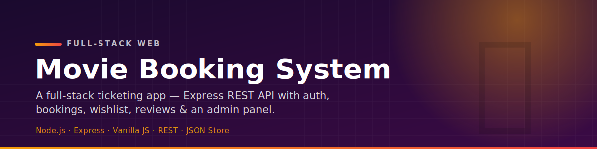
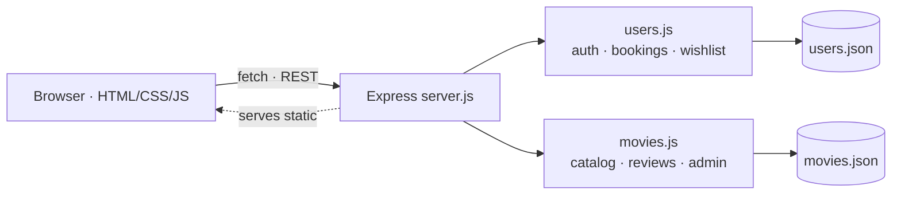

<p align="center">
  
</p>

<p align="center">
  
  
  
  
  
</p>

<p align="center">
  A full-stack movie-ticketing web app — user auth, a browsable catalog, ticket booking,
  a personal wishlist, reviews & ratings, and an admin panel — all backed by a<br>
  Node.js / Express REST API with JSON-file persistence.
</p>

---

## ✨ What it does

- 🔐 **User auth** — sign up, log in, and session-scoped access to bookings and wishlist.
- 🎞️ **Movie catalog** — browse all available movies with details.
- 🎟️ **Ticket booking** — book tickets and view or cancel your bookings.
- ❤️ **Wishlist** — add and remove movies from a personal list.
- ⭐ **Reviews & ratings** — submit a review and a star rating per movie.
- 🛠️ **Admin panel** — add, edit, and remove movies from the catalog.
- 🗃️ **JSON persistence** — users and movies are stored in `public/src/data/*.json`.

## 🏗 Architecture



## 🔌 API endpoints

| Method | Route | Description |
| ------ | ----- | ----------- |
| `GET` | `/users` | List all users |
| `POST` | `/new_user` | Register a new user |
| `POST` | `/login` | Authenticate a user |
| `GET` | `/movies` | List all movies |
| `POST` | `/add_movie` · `/modify_movie` · `/remove_movie` | Catalog admin |
| `POST` | `/book_movie` · `/cancel_movie` | Book / cancel a ticket |
| `POST` | `/addToWishList` · `/removeFromWishList` | Wishlist management |
| `POST` | `/submit_review` | Submit a review / rating |

## 🗂 Project structure

```text
├── server.js                # Express server + all API routes
├── package.json
├── .env.example             # copy → .env and set PORT
└── public/
    ├── index.html           # entry point
    └── src/
        ├── backend/         # users.js, movies.js (data logic)
        ├── frontend/        # per-page controllers (login, bookMovie, admin, …)
        ├── ui/              # page HTML + stylesheets
        └── data/            # movies.json, users.json (persistent store)
```

## 🚀 Quickstart

```bash
npm install
cp .env.example .env     # set PORT (defaults to 3000 in the example)
node server.js
# open http://localhost:3000
```

## 🧰 Stack

| Layer | Tech |
| ----- | ---- |
| Backend | Node.js, Express 5, dotenv |
| Frontend | Vanilla JavaScript, HTML5, CSS |
| Data | JSON-file persistence (`public/src/data`) |
| API | REST over `fetch` |
